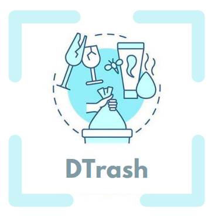
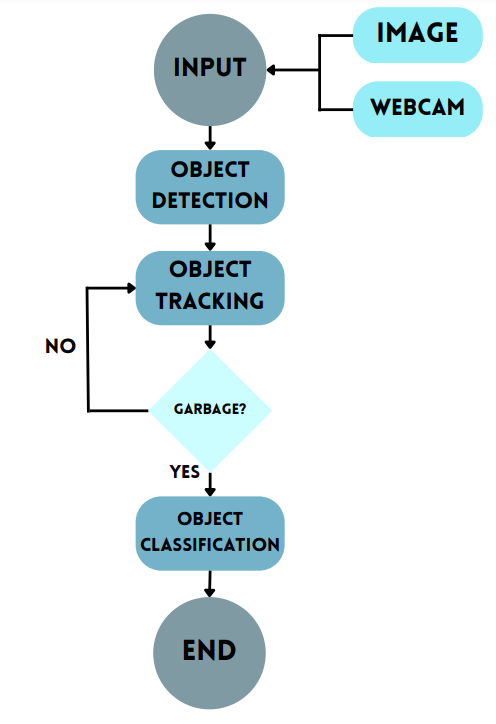
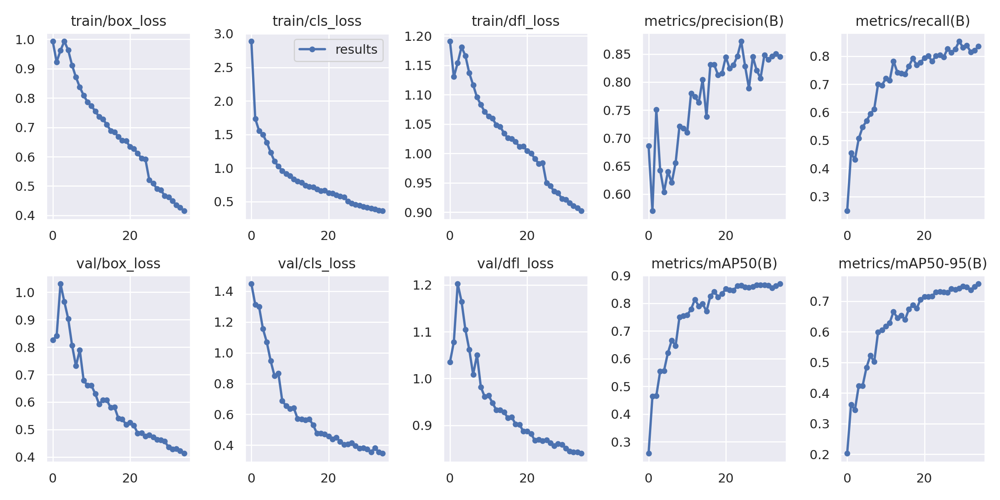
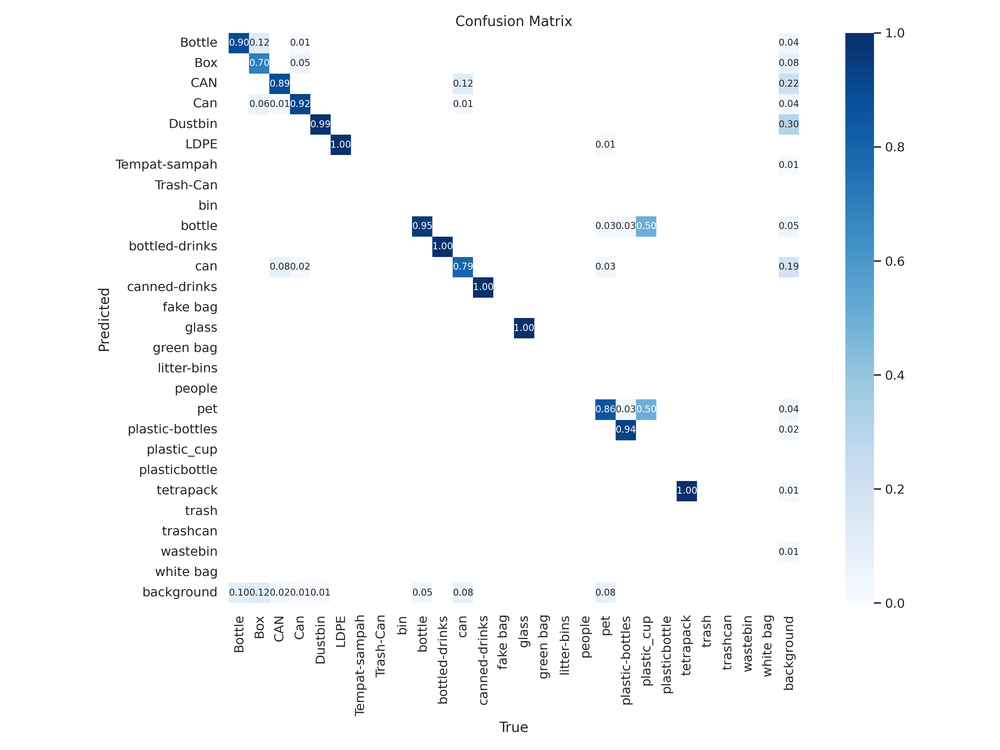
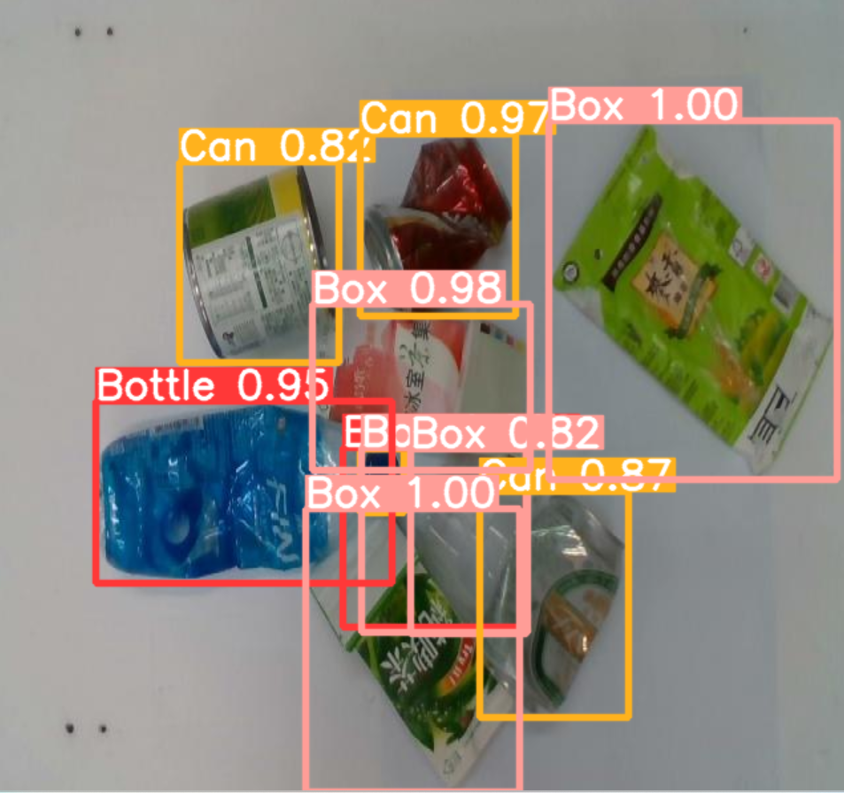

## Team Member 
- Thekra Alhameedy
- Lolo Almuqbil 
- Raghad Alsalamah
  
## The Roles  
We worked equally.
  
## Dataset Overview  
This [dataset](https://universe.roboflow.com/asmaa-rashed-alahmari-fvl6d/wastebasket_trash_detecation/dataset/3)  collection of curated data for a deep-learning project. An image dataset includes digital images curated for testing, training, and evaluating the performance of artificial intelligence (AI) algorithms, like computer vision algorithms. We want to thank Asmaa Rashed Alahmari for providing us with the dataset we needed. It's been a great help, and we're extremely grateful for her efforts.

## Introduction
The increasing amount of garbage in the environment is a major issue that poses a threat to human health and the ecosystem. The inadequate collection, segregation, and disposal of waste have led to numerous environmental and health hazards. 
To address this problem, a garbage detection system was developed that can detect and classify different types of garbage.

## Objectives
The main objective of this project is to develop a garbage detection system that can:
- Detect and classify different types of garbage in real-time.
- Monitor the performance of the cleaning staff to ensure that they do their job perfectly to preserve the environment.
- Help reduce the amount of environmental waste and promote sustainable waste management practices.

 ##  Libraries
- cvzone
- ultralytics
- hydra-core 
- matplotlib 
- numpy 
- opencv-python 
- PyYAML 
- requests 
- scipy 
- torch 
- torchvision 
- scikit-image 

## Methodology
In this project, we used the YOLO v8 model (You Only Look Once), which deals with object detection in a different way. It takes the entire image in a single instance and predicts these boxes' bounding box coordinates and class probabilities. The biggest advantage of using YOLO is its speed; it’s incredibly fast and can process 45 frames per second. It also understands generalized object representation.
The garbage detection module has two types of input: images and a webcam using computer vision. The images are preprocessed and transformed using various image processing techniques, including edge detection, segmentation, and feature extraction, to decide whether it's a garbage object or not. Then the preprocessed input is fed into a YOLO model that uses deep learning algorithms to classify garbage objects.

 Dtrash Methodology 

## Final Resulte

  Accuracy results 

 Confusion Matrix 

## Testing
- The garbage detection system was tested in different environments, including residential areas, commercial areas, and public places. 
- The system was able to detect and classify different types of garbage with high accuracy.

### 
 

 Testing (upload image) 

## Future work
Due to a lack of time, many different adaptations, tests, and experiments have been left for the future. The system can be further improved by adding more features such as:
- The system records the time taken by the cleaning staff to collect the garbage in each location and then compares the time taken to the standard time allocated for each location to determine if the cleaning staff is performing their job perfectly.
-  If there is some garbage that remains in place for more than two days, the system sends an alert to the supervisory staff to take corrective action.
- Developing the model to add it to Drone.
- Predict the need for the number and type of containers.

## Conclusion 
The garbage detection system was tested in different environments, and the system was able to detect and classify different types of garbage with high accuracy. It's developed in this project and provides a reliable and efficient solution to the problem of garbage detection and management. The system can detect and classify different types of garbage in real-time, and help reduce the amount of waste in the environment.
